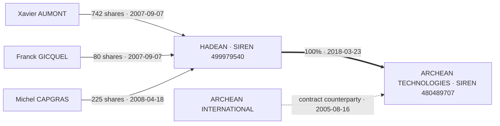

# Takeovers Engineering Challenge — Submission Report: Actes Track

**Subject Company:** ARCHEAN TECHNOLOGIES (SIREN `480489707`)  
**Track:** Data / ML Engineer  
**Candidate:** `Tamura-cloud`  
**Detailed dossier & decision log:** [`docs/RELATORIO_TECNICO_PROJETO.md`](docs/RELATORIO_TECNICO_PROJETO.md) for the 20-year technical breakdown, and [`docs/DEVLOG_AI.md`](docs/DEVLOG_AI.md) for the findings that changed the course of the work.  
**Walkthrough recording (3:51):** [ERICK TAMURA WALKTHROUGH — YouTube](https://www.youtube.com/watch?v=iM0S-BWTw5g) — the `--audit`, the determinism proof, live grounding, the OCR errors, and the bonus graph.

---

## 1. Executive Summary

This repository contains the complete historical reconstruction of the capital composition of **ARCHEAN TECHNOLOGIES (SIREN 480489707)** across its 20-year operational history (2004–2025), derived from 17 official corporate acts deposited with the French commercial registry (INPI) and 300-DPI OCR layers.

The brief is explicit about the shape of the answer: *"The timeline is the one that matters. Events are how you justify it."* That is the shape of this submission — **nine capital states** are the deliverable, and the **31 grounded events** are the evidence standing under each one.

### Key Highlights:
* **`results.json` Deliverable:** Located at repository root, fully compliant and validated against `challenges/actes/schema/results.schema.json`.
* **31 Grounded Events:** Every corporate event carries strict provenance (`inpi_id`, `page`, normalized `bbox [x0, y0, x1, y1]`, and text `snippet`).
* **9 Reconstructed Capital States:** From incorporation at **37.000 €** to the current stable capital of **400.000 €**, closed with 100% share-conservation consistency.
* **94 of 96 invariant checks pass, and the two failures are the point.** `python main.py --audit results.json` reports **REPROVADO** and exits non-zero, on purpose. Invariant #5 fails on exactly one holder: **Antonio BLANCO MARINA, 953 shares**, who leaves the cap table between 2008-04-18 and 2008-06-27 with no act in *either* company's folder recording it — a corpus-wide OCR sweep finds his name 11 times, all in Archean's own filings. Invariant #8 fails on the 2008 consolidation, because that transition is modelled as a single wholesale entry rather than by the movements composing it. Both are declared, not smoothed over. **Invariant #9 covers the bonus graph**, which was the only field in the deliverable with no check at all — and had silently kept the deposit dates (2007-09-18, 2008-04-30) while the events had already moved to the effect dates.
* **Invariant 7 enforces the brief's own definition.** The brief defines `capital_timeline[]` as *"the state of the cap table after each of those events"*. Invariant #7 checks precisely that: every state's causes must exist and precede it, and every event date must have a state. It is the only check that links the two artefacts — and it is what surfaced a state dated `2005-05-17` whose own cited causes were all from `2005-08-16`.
* **The Group Bonus (`group`):** Reconstructed corporate ownership proving that holding company **HADEAN (SIREN 499979540)** acquired and owns 100% of Archean Technologies.
* **Provenance verified, not asserted:** all **36/36** submitted citations — the 31 events **plus the 5 bonus-graph edges** — were re-located inside the shipped OCR, and all **36** reproduce the declared `bbox` to within 0.002. Getting there took four passes, each one finding a defect an earlier version called something kinder. Two boxes were wrong — one clipped the first character of its line, the other omitted the last line of the quotation it was meant to support. Two other events carried **weak citations**: one quoted two words and matched at 0.34 across two different documents; the other carried a box sliced off the transfer event, pointing at a different part of the page than the text. **The fourth pass is why the count is 36 and not 31:** `--benchmark` iterated only `events[]`, so the graph's five edges had never been measured by anything — and one of them was carrying a box that stopped at the width of its *second* line, clipping the end of the first. A field outside the check had drifted, exactly as the `group` field had done before Invariant #9 existed. All were caught by measuring and by drawing the declared and the recomputed box on the rendered page — never by reading the claim. The brief's reading criteria include *"whether the boxes point where you say they do"*, which is why this is spelled out. Seven of the events cite **Hadean's** filings rather than Archean's — the check searches the whole corpus, not just the subject's folder. Reproduce with `python main.py --siren 480489707 --benchmark results.json`.
* **Contradictions found and declared:** the acts disagree among themselves, and both cases are named in `results.json.notes` — the 2006-01-04 cession protocol records a share split that the movements register corrects (item 1), and Article 6 of the 2018 statutes states the capital as `185 759 €` where the first resolution of the same act proves `182 759 €` (item 3). Plus six OCR transcription errors on pages we actually cite — including a **factor-1000 misread** (`200.0euros` where the document reads `200.000 euros`) — and one share-allocation error *we made ourselves* and corrected against the scanned image. All are listed in `results.json.notes`.
* **Zero External API Cost:** `results.json` is assembled by local Python and needs no paid endpoint — no network access is required to reproduce or verify the submitted artefact.
* **How the timeline was built, stated plainly:** the nine Archean states were **typed by hand** in `reconcile_timeline.py::build_timeline()` after reading the acts, then machine-checked. They are **not** derived from the `events` array. That distinction matters and §3 spells out what it costs. The derivation engine (`src/ledger.py`) is real and is used — but on the other companies, not on the submitted file.

### The bonus graph, drawn



The parent did not buy Archean: the three individual shareholders **contributed their Archean shares to Hadean**, and that is what took the parent to 100%. The evidence for it sits in `data/499979540/` — **Hadean's** folder, not Archean's — which is exactly where the brief says to go and look (*"It does not stop at one hop"*). Dashed edges are the ones that are **not** shareholding: `ARCHEAN INTERNATIONAL` is the counterparty the brief warns is *"named in another's filings without owning anything"*, and it is modelled as `contract_counterparty`, not as ownership.

All five edges carry their own `source` — document, page, normalised box and snippet — and all five are now measured by `--benchmark` alongside the 31 events. That is why the verification count reads **36**, not 31.

---

## 2. How to Run

### Requirements
```bash
pip install -r requirements.txt
```

### Reproduce the submitted artefact
```bash
python reconcile_timeline.py
```
Rebuilds `results.json` from the hand-assembled states in `reconcile_timeline.py`, re-checks the algebraic invariants across all nine epochs, and validates the output against `challenges/actes/schema/results.schema.json`. Deterministic, offline, and requiring no credentials.

### Verify what is claimed (no API key needed)
```bash
# Nine invariants + schema, against the submitted file
# Expected: 94/96 and exit code 1. The two failures are invariant #5 and #8,
# both declared — see §5. A green run here would mean the checks are broken.
python main.py --audit results.json

# Re-locate every snippet in the shipped OCR and diff the bbox against the claim
python main.py --siren 480489707 --benchmark results.json

# Point out OCR transcription errors (optionally restricted to cited pages)
python main.py --siren 480489707 --ocr-errors --benchmark results.json

# Where does a phrase sit, in submittable coordinates?
python main.py --siren 480489707 --ground "Le capital social est fixé à la somme de trente sept mille"

# See the capital evolve: composition bar per state, and — beside each citation —
# the crop of the actual page it was read from, so the claim shows its own proof.
# Add --sem-imagens for the text-only version (29 KB instead of 2 MB).
python main.py --timeline-html results.json
```
`--benchmark` is the check that matters: it answers *"do the boxes point where you say they do?"* without trusting either the OCR or our own claims.

### Any company in the corpus — and the optional LLM reader

Nothing in `src/` is Archean-specific. Given a SIREN, the same code triages the corpus, grounds the citations and derives the ledger:

```bash
# Read a company's OCR with DeepSeek, propose events, then ground + verify them
python main.py --siren 820561470 --extract --output controls/results_pautet_llm.json

# Same destination, but from events a human already wrote
python main.py --events events/events_820561470.json --output controls/results_820561470.json
```

**SARL PAUTET (SIREN 820561470)** is carried in this repository as a control case, because its cap table was read by hand first, boxes included. The timeline derived from the model's reading is **identical field by field to the hand-derived one** — 1 000 shares in 2016 and 15 000 in 2022, same holders, same dates — and both pass every invariant. The model emitted 2 events where the human emitted 5; both routes land on the same cap table. The raw model proposal is frozen to `events/events_820561470_candidate.json` so that the *unverified* reading can still be audited after the fact.

### Inspect Visual Grounding (Bounding Boxes)
To verify any event's red bounding box drawn directly over the original scanned document:
```bash
# Example: Incorporation capital (Act 1, Page 3)
python quick_check.py --doc 1 --page 3 --bbox [0.1201, 0.3994, 0.6591, 0.4146]

# Example: 50.000 € Capital Increase (Act 4, Page 3)
python quick_check.py --doc 4 --page 3 --bbox [0.0499, 0.1685, 0.9479, 0.2007]
```

---

## 3. Trade-offs Made

1. **Hand-assembled timeline, machine-checked arithmetic.**
   The nine Archean states were **assembled by hand** in `reconcile_timeline.py::build_timeline()`: each holder, share count and percentage was read from the acts and typed in as a literal. They are **not** derived from the `events` array — the two are parallel hand-authored artifacts.

   That trade-off has a cost, and it should be named rather than hidden: **two hand-authored artifacts can drift apart, and nothing in the build catches it.** The invariants check the timeline's internal arithmetic, not that it follows from the events. What they *do* catch is real — share closure, capital identity, percentage closure, flow conservation, date consistency — and they are what surfaced the 803/637 transposition in §4.

   `src/ledger.py` is a genuine derivation engine, and the PAUTET control case in §2 is produced by it end to end, events to states, with no typed balances. It does **not** produce the Archean timeline. Run it on the submitted events and the two timelines agree up to **2005-08-16**, then diverge from **2006-10-20** on (**2 225 shares against 2 000**), ending at **202 822 against 368 102**: the events do not carry the share allocation of each intermediate capital movement, and the 2005-08-16 transfer names sources (GUELLATI, LEROUX, ROUJEAN) who never enter the cap table in the event list at all. Closing that gap means sourcing an allocation event for every intermediate increase — an honest next step, not a claim we can make today.
2. **Normalized Bounding Boxes (0.0 to 1.0) vs. Raw OCR Pixels:**  
   While raw OCR polygons are provided in 300-DPI pixels, our pipeline dynamically translates them using the PDF point geometry (measured dynamically per page via PyMuPDF `page.rect`, typically $\sim 1654 \times 2353$ pt for these scanned dossiers $\times \frac{300}{72}$) into normalized coordinates `[x0, y0, x1, y1]`, ensuring exact resolution-independent rendering matching `tools/bbox_viewer.py`.
3. **Ergonomic CLI Tooling:**  
   `tools/bbox_viewer.py` was wrapped by `quick_check.py` to eliminate repetitive manual path typing, and enhanced to accept flexible BBox inputs (with/without brackets, spaces, or commas).

---

<a id="ai-tools"></a>
## 4. How I used AI

**Tools.** GitHub Copilot (DeepSeek V4.1 Flash) in VS Code agent mode, as a pair programmer. DeepSeek `deepseek-chat` is also wired into the optional extractor of §2. Earlier scoping drafts used Claude and Gemini.

**What it did.** Drafted the PyMuPDF geometry, the grounding matcher, the ledger and the report renderers; swept the acts to locate movements and dates.

**What I checked myself.** Every share count and every date, against the **rendered page image** — not the OCR text, which is the input under suspicion.

**Where it was wrong.** Six things. The last four were caught by the checks in §2, not by reading — which is what the checks are for.

| # | What it got wrong | How it surfaced |
|---|---|---|
| 1 | Claimed `results.json` was "produced by a deterministic ledger". It is not — the states are typed by hand. | Invariant #7, added to enforce the brief's own definition of `capital_timeline[]`, found a state dated `2005-05-17` whose cited causes were all from `2005-08-16`. |
| 2 | Graded the output against the OCR instead of the image. | The image reads `(37.000)` where the OCR says `(37.0o0)`. Order inverted: image first, OCR as locator only. |
| 3 | Treated `allocation` as an assignment rather than a delta. | 14 000 shares against a 150 000 € capital at a 10 € nominal — a 15× error. The act's own share numbering ("de 1 à 510 et de 1001 à 8140") settles it: the model's reading was right, the ledger was wrong. |
| 4 | Trusted OCR confidence scores to find errors. | The provably wrong `(37.0o0)` scores **0.988**, against a corpus median of 0.991. Detection moved to numeric-token patterns (`src/ocr_audit.py`). |
| 5 | Silently dropped every event it could not ground. | The brief says the opposite — *"an event you cannot ground is still worth reporting, with a note saying so"*. |
| 6 | Read deposit dates as effect dates. | Twice, in writing, in its own notes. Effects are 2007-09-07 and 2008-04-18; deposits, 2007-09-18 and 2008-04-30. |

---

## 5. What Was Left Undone & Next Steps

**Unresolved, and declared as such in `results.json.notes`:**

* **One exit remains undocumented: Antonio BLANCO MARINA, 953 shares.** The other three individual shareholders of that period are documented — but **not in Archean's own folder**. Xavier Aumont (742) and Franck Gicquel (80) contributed their holdings to the parent **Hadean** at its incorporation, and Michel Capgras (225) did the same on 2008-04-18; both are *effect* dates, months before the deposit dates in the filenames. All three are now emitted as `SHAREHOLDER_SHARE_TRANSFER` + `SHAREHOLDER_END` citing the parent's acts. **Blanco is different**: no act in either company's folder records his departure, and a corpus-wide OCR sweep finds his name 11 times, every one of them in Archean's filings. That is the single remaining failure — invariant #5 — and it is declared, not smoothed over. See `results.json.notes` item (2).
* **Six OCR errors sit on pages we actually cite**, all with high confidence scores (0.956–0.988). Every submitted snippet uses the correct value, but the OCR corpus itself was not rewritten.

**Explicitly out of scope:**

* **Multi-hop Group Traversal:** we proved the parent link to **HADEAN (SIREN 499979540)** and the contractual counterparty **ARCHEAN INTERNATIONAL**, but did not expand into Hadean's own upstream shareholders. The brief warns the chain does not stop at one hop, and some of those links live only in the *bilans*, which belong to the other challenge.
* **Scaling:** across 10,000+ companies, a deterministic ledger plus a lexical pre-filter should be complemented by a vision-language model reading the **rendered page**, not the OCR text, to propose candidate events. The *bilan* brief explicitly sanctions this approach.

---

## 6. Environment & Credentials Disclosure

* As required by the briefing, this submission includes a **`.env.example`** naming every variable the code reads, with **no secrets in it**. The values it shows are the pipeline's own defaults — a reader can see what the code uses, and which variables are worth overriding, without any key being present.
* **The submitted `results.json` requires no keys at all.** It is produced locally by `reconcile_timeline.py`, and every verification command below runs offline. The brief explicitly notes this is *"a legitimate and interesting answer"*.
* The repository also contains an **optional** semantic extractor (`src/extractor_llm.py`) that calls a DeepSeek endpoint through the OpenAI-compatible SDK. It is **not** on the path that produced the submitted artefact, its output is gated behind the same grounding and invariant checks as everything else, and it stays disabled unless `DEEPSEEK_API_KEY` is set — `python main.py --offline` exercises the full pipeline without it.

---

## 7. Document Triage Matrix (Summary of the 17 Acts)

| Act | Filing Date | Document Subject | Decision | Legal / Scope Rationale |
| :---: | :---: | :--- | :---: | :--- |
| **1** | 2005-01-25 | Constitution | **INCLUDED** | Baseline state: 37.000 € initial capital, 3 founding shareholders. |
| **2** | 2006-01-03 | Constatation d'augmentation | **INCLUDED** | 1st Capital Increase (+113.000 € $\to$ 150.000 €). |
| **3** | 2006-01-04 | Cession d'actions / Sortie | **INCLUDED** | Exit of 3 temporary investors; rectification of protocol error. |
| **4** | 2007-02-20 | Augmentation du capital social | **INCLUDED** | 2nd Capital Increase (+50.000 € $\to$ 200.000 €) and entry of Michel Capgras. |
| **5** | 2008-06-23 | Rapport avantages particuliers | **INCLUDED** | CAA report on creation of Class A & B preference shares (`CAPITAL_DUAL_CLASS`). |
| **6** | 2008-07-15 | Augmentation du capital social | **INCLUDED** | Split 100:1, acquisition by HADEAN, issuance of A & B shares (368.102 €). |
| **7** | 2008-09-08 | Rapport complémentaire | *Annex* | Technical complement to Act 6 preference share valuation. |
| **8** | 2010-12-08 | Changement d'objet social | **EXCLUDED** | Out of scope: Corporate object change; capital remained unchanged at 368k €. |
| **9** | 2010-12-08 | Changement d'objet social | **EXCLUDED** | Duplicate/extract of Act 8. |
| **10** | 2011-07-11 | Date de clôture | **EXCLUDED** | Out of scope: Fiscal year closing date change. |
| **11** | 2011-07-11 | Date de clôture | **EXCLUDED** | Duplicate/extract of Act 10. |
| **12** | 2013-02-12 | Transfert de siège social | **EXCLUDED** | Out of scope: Address transfer to Avenue d'Italie; capital unchanged at 368k €. |
| **13** | 2017-01-20 | Réduction du capital social | **INCLUDED** | EGM authorization to reduce capital by buying back and cancelling 150.861 B shares. |
| **14** | 2017-03-28 | Réduction du capital social | **INCLUDED** | Realization of capital reduction to 217.241 €; exit of the 4 VC funds. |
| **15** | 2018-05-30 | Augmentation du capital social | **INCLUDED** | Capital increase to 400.000 € via reserves incorporation for HADEAN. |
| **16** | 2018-11-02 | Démission de commissaire | **EXCLUDED** | Out of scope: Statutory auditor resignation. |
| **17** | 2025-12-02 | Approbation des comptes | **EXCLUDED** | Out of scope: Ordinary annual approval of 2023 accounts; capital stable at 400k €. |

---

<a id="submitting"></a>
## Submitting

`challenges/actes/BRIEF.md` links to `../../README.md#ai-tools` and `../../README.md#submitting`.
Those two anchors are defined in this file, so the brief's own links resolve inside this repository.

**What is submitted:** `results.json` at the repository root (the Actes deliverable), plus the code
that produced it and the code that audits it. The submitted artefact needs no API key and no network.

**How it is submitted:** as a **pull request** from `feature/actes-reconstruction` into `main`, per the
brief's ground rules — *"submission is a PR to your own repository"*. `main` holds the repository as it
was received; the PR carries the whole reconstruction in 29 commits, so the diff *is* the work, and a
reviewer can read it commit by commit rather than taking the result on trust.

**Layout:** `src/` is the reusable pipeline (loader, pre-filter, grounding, ledger, validator,
reports); `main.py` is the CLI; `reconcile_timeline.py` is the Archean-specific assembler behind the
submitted file. `events/` holds the events as data — the *reading* — deliberately separated from the
code that checks it. `data/` is the third-party corpus: untracked, both for size and because the
corpus `NOTICE.md` asks that it not be redistributed.

---
*Takeovers SAS Engineering Challenge Submission — September 2026*
